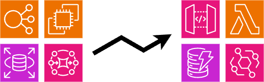

<p align="center">
  
</p>

# SVS402 Refactoring Java applications to Serverless

In this chalk talk you will learn how to take an existing Java application and refactor it to reduce operation overhead 
and improve scalability, availability and reliability.

This will be demonstrated with a microservice for the Serverless Video application, which has been made for re:Invent 2023. The
microservice will allow authenticated visitors to show their appreciation for a video by clapping. A visitor can clap
a video multiple times if they want to. The number of claps will be visible on the website to show other visitors which
are the most appreciated videos.

<p align="center">
  
</p>

## System Components

There are 3 components to focus on.

### 1. Read the number of claps for a video

The system will provide a REST API to read the number of claps for a given video or a list.

**Assumptions**

Depending on the traffic to the website the read endpoint could be optimized to return from a cache instead of
retrieving the information from the data store each time. This could be done with a
[Amazon CloudFront](https://aws.amazon.com/cloudfront/) distribution or with
[Amazon API Gateway caching](https://docs.aws.amazon.com/apigateway/latest/developerguide/api-gateway-caching.html). For
this demo we will assume the traffic is below this number.

### 2. Allow users to clap for videos

The system will provide a REST API to add 1 to the number of claps a video has.

**Assumptions**

The expectation is that a relatively large number of visitors will be clapping for a relatively small number of videos.
To enable this the system will use the store and forward enterprise integration pattern. API Gateway will acknowledge
the request after it has been put onto an Amazon SQS queue. A Lambda function can then read a batch of messages at once
and batch update the data store.

In a real production system you would most likely restrict this feature to authenticated users.

### 3. Listen for video creation events

The system will listen for VideoCreation events and use the data from them to build its own record of a video. It will 
then schedule a task to be run in the future. This will notify the videos creator of how many claps their video received 
in the first hour.

## Existing Architecture

The following diagram shows how the system could be built without using serverless services.

<p align="center">
  
</p>

## Refactoring

### 1. Read API

<p align="center">
  
</p>

Changing the architecture from load balancers and application servers to API Gateway and Lambda means that 
we need to refactor our application slightly. This is because the load balancer will make a HTTP connection to
an application server, whereas API Gateway sends a JSON event to Lambda which is processed synchronously. 

The refactor will add the capability to handle API Gateway JSON events while maintaining as much of the Spring
Boot Web application as possible. To do this you will use the [Serverless Java Container](https://github.com/awslabs/aws-serverless-java-container) project.
The dependency is added to the Maven [pom.xml](https://github.com/maschnetwork/svs402-java-serverless-migration/blob/main/software/rest-api/pom.xml) file.
Then you need to change the infrastructure to make use of the new dependency. Update the handler parameter of the
function and add an environment variable to define the Spring Boot main class.

From [InfraStack.java](https://github.com/maschnetwork/svs402-java-serverless-migration/blob/main/infra/src/main/java/infrastructure/reinvent/serverlessflix/claps/InfraStack.java)
```java
.handler("com.amazonaws.serverless.proxy.spring.SpringDelegatingLambdaContainerHandler")
.environment(Map.of(
        "MAIN_CLASS", "software.serverlessflix.claps.ClapsWebApp",
```

This function is called synchronously by the front end. Latency of cold starts can be improved using [Lambda SnapStart](https://docs.aws.amazon.com/lambda/latest/dg/snapstart.html). 
SnapStart can improve start-up performance by up to 10x at no additional cost. It does this by creating of a snapshot of 
your virtual machine after the JVM has started and loaded your application code. New Lambda function environments are 
created from the snapshots instead of being created from scratch, this improves latency.

### 2. Store claps

<p align="center">
  
</p>

We can reduce the complexity of this part of the system by using the [API Gateway service integration](https://docs.aws.amazon.com/apigateway/latest/developerguide/how-to-integration-settings.html) with SQS. Doing 
this allows you to implement the store and forward pattern without managing any servers and also gives you improved 
scalability and fault tolerance.

From [InfraStack.java](https://github.com/maschnetwork/svs402-java-serverless-migration/blob/main/infra/src/main/java/infrastructure/reinvent/serverlessflix/claps/InfraStack.java)
```java
var integrationOptions = IntegrationOptions.builder()
        .integrationResponses(List.of(IntegrationResponse.builder().statusCode("200").build()))
        .requestTemplates(Map.of( "application/json", "Action=SendMessage&MessageBody=$input.body"))
        .requestParameters(Map.of("integration.request.header.Content-Type", "'application/x-www-form-urlencoded'"))
        .passthroughBehavior(PassthroughBehavior.NEVER)
        .credentialsRole(sqsRole)
        .build();
```

The Spring application which listens to a queue can now be refactored to a Lambda function and an event source mapping
to SQS. The application's business logic will be the same, but instead of using `@JMSListener` you will add a new Lambda
[handler class to receive an `SQSEvent`](https://github.com/maschnetwork/svs402-java-serverless-migration/blob/main/software/clap-processor/src/main/java/software/serverlessflix/claps/ClapProcessor.java).

This architecture is cost optimized by processing the requests in batches. The Lambda event source is configured to 
receive a maximum of 25 messages or everything which has arrived within a second. The application then writes the update
in a batch.

From [InfraStack.java](https://github.com/maschnetwork/svs402-java-serverless-migration/blob/main/infra/src/main/java/infrastructure/reinvent/serverlessflix/claps/InfraStack.java)
```java
var sqsEventSource = SqsEventSource.Builder
                .create(sqsQueue)
                .batchSize(25)
                .maxBatchingWindow(Duration.seconds(1))
                .build();
```

The sample application could be further extended to make use of the [partial batch failure](https://docs.aws.amazon.com/prescriptive-guidance/latest/lambda-event-filtering-partial-batch-responses-for-sqs/best-practices-partial-batch-responses.html) 
functionality that Lambda provides with SQS.

### 3. New videos and notification scheduling

<p align="center">
  
</p>

This refactor cover 2 different requirements. The first is to listen to a video creation event and create a record
within the microservice data store. The second is to schedule a task to be executed in the future to notify the video
creator.

Just like in refactor 2, you can follow the same pattern to listen to a message with Lambda. 

The [NewVideoHandler.java](https://github.com/maschnetwork/svs402-java-serverless-migration/blob/main/software/new-video-function/src/main/java/software/serverlessflix/claps/NewVideoHandler.java) 
show you how to deserialize an EventBridgeEvent with your own custom payload.

```java
public void handleRequest(InputStream input, OutputStream output, Context context) throws IOException {
    var event = objectMapper.readValue(input, new TypeReference<EventBridgeEvent<Video>>(){});
    var video = event.detail();
```

With the serverless architecture the functionality which notifies the creator has been broken away into a separate Lambda
function. This reduces the complexity of the Lambda function which handles new videos. If a new notification mechanism 
was added in the future we would no longer have to redeploy the other Lambda function and risk breaking new videos.

Again, the business logic stays the same, but the way the business logic is invoked it different. Instead of using an 
open source scheduler like Quartz, you can use EventBridge Scheduler. This managed services means that you don't have to
have long-running, highly available processes to handle infrequent activity. 

## Serverless High Level Design

The following diagram show the final high level architecture for the system.

<p align="center">
  
</p>

## Deploy the Microservice

If you are interested in understanding this in more depth, you can deploy this whole microservice with CDK into
your own environment. To remove the resources, follow the clean up steps below.

### Requirements

- [CDK](https://docs.aws.amazon.com/cdk/v2/guide/getting_started.html)
- [AWS SAM](https://docs.aws.amazon.com/serverless-application-model/latest/developerguide/install-sam-cli.html)(for Logs only)

### Deployment

```bash
./build-deploy.sh
```

### Testing

Create test videos:

```bash
aws events put-events --entries '[{"Source":"software.serverlessflix.video", "EventBusName":"videos", "DetailType":"new-video","Detail":"{\"id\": \"best-video\",\"channel\" :\"This channel\",\"title\" :\"This is not the best video in the world\",\"author\": {\"username\" : \"Max\", \"email\" : \"something123454@amazon.de\"}, \"playbackUrl\": \"/best-video-12343\", \"createdAt\": \"2023-10-16\"}"}]'

aws events put-events --entries '[{"Source":"software.serverlessflix.video", "EventBusName":"videos", "DetailType":"new-video","Detail":"{\"id\": \"svs402-recording\",\"channel\" :\"My channel\",\"title\" :\"SVS 402 Recording\",\"author\": {\"username\" : \"Mark\", \"email\" : \"something123454@amazon.de\"}, \"playbackUrl\": \"/svs-red-14543\", \"createdAt\": \"2023-10-16\"}"}]'
```

Call REST-Api (All Videos):

```bash
curl --location --request GET $(cat infra/target/output.json | jq -r '."SVS402-InfraStack".ApiEndpointSpring')'/videos' | jq
```

Call REST-Api (Single Videos):

```bash
curl --location --request GET $(cat infra/target/output.json | jq -r '."SVS402-InfraStack".ApiEndpointSpring')'/videos/svs402-recording' | jq
```

Generate some claps for the videos: 

```bash
artillery run -t $(cat infra/target/output.json | jq -r '."SVS402-InfraStack".ApiEndpointSpring') -v '{ "url": "/claps" , "videoId" : ["best-video", "svs402-recording"]}' infra/loadtest.yaml
```
Or call single API:

```bash
curl --location --request POST $(cat infra/target/output.json | jq -r '."SVS402-InfraStack".ApiEndpointSpring')'/claps' --data-raw '{
    "video": "best-video"
}' --header 'Content-Type: application/json' | jq
```

Retrieve videos and clap counts:

```bash
curl --location --request GET $(cat infra/target/output.json | jq -r '."SVS402-InfraStack".ApiEndpointSpring')'/videos' | jq
```

Check for the scheduled notification (Implemented by logging to Cloudwatch - scheduled for 5 minutes after video creation):

```bash
sam logs --stack-name SVS402-InfraStack | grep "NotifyCreator"
```

### Clean up

```bash
cd infra
cdk destroy
```

## Learn more

To learn more about Serverless architectures go to [ServerlessLand](https://serverlessland.com/)